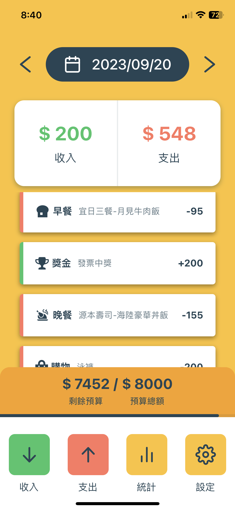

# 極簡學生記帳軟體
## 市面上記帳軟體功能複雜、操作不直觀，主要為社會人士設計。作者身為學生，想專為學生群體設計一款簡單操作的記帳軟體，包含收入、支出、預算、圖表、每日提醒的功能
## 使用React Native + Expo，後端採用Expo SQLite，相關數據儲存在用戶手機上
---

  

    
首頁

    
  

  

    
首頁

    
  

  

    
首頁

    
  

  

    
首頁

    
  

