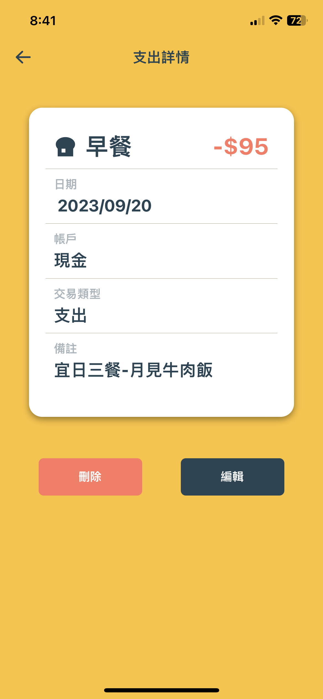

## 極簡學生記帳軟體
市面上的記帳軟體通常功能繁雜、操作複雜，主要針對社會人士。我身為學生有意設計一款簡單易用的記帳軟體，專為學生群體打造。
這款APP將包括收入和支出的記錄、預算設定、圖表呈現財務狀況，以及每日提醒功能，使學生能夠輕鬆管理自己的財務事務，同時方便操作。

---

## 技術架構概要
使用React Native + Expo開發。後端使用Expo SQLite，使得能將數據本地儲存在用戶手機上，實現高效的本地數據存取。

---

## iOS Demo：
需下載Expo Go：https://apps.apple.com/tw/app/expo-go/id982107779)

  
---

## APP部分截圖：

  
  
  
  
  
  
  
  
  

